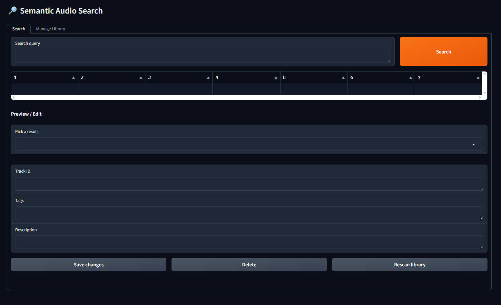
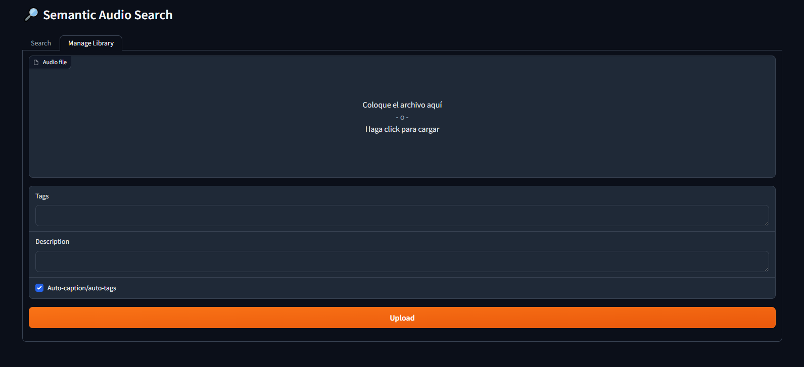
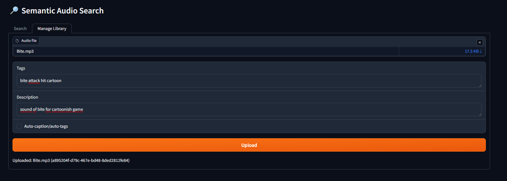

# Semantic Audio Search

A self‑hosted semantic audio search stack that indexes your sound library, auto‑tags files, and lets you find and preview audio with natural‑language queries.

**Stack:** FastAPI (Python) · CLAP embeddings · Qdrant vector DB · SQLite · Gradio UI · Docker

---

## What it does

- **Semantic search:** Type things like “applause” or “bad feedback buzzer” and get the right sounds first.
- **Auto‑metadata:** Lightweight auto‑tagging powered by text–audio similarity. Optionally merges with your own tags/descriptions.
- **Hybrid ranking:** Combines vector similarity with keyword matches (filename, tags, description).
- **Library sync:** Reindex or incremental rescan to keep Qdrant and SQLite in sync with your library folder.
- **Inline preview:** Play audio directly in the UI and copy/download the file URL.
- **Simple admin:** Edit tags/description, delete tracks, bulk update via API.

---

## Architecture

```
+-----------+       +------------------+         +-----------------+
|  Gradio   | <---> | FastAPI (CLAP,   |  upsert |     Qdrant      |
|   UI      |   API |   auto-tags, DB) | <-----> |  vector search  |
+-----------+       +------------------+         +-----------------+
                         |     |
                         |     +---- SQLite (metadata)
                         |
                         +---- Library folder (audio files; served via /media)
```

- **Embeddings:** `laion/clap-htsat-unfused` for both audio and text.
- **Auto‑tags:** Matches each audio file against a configurable label list via CLAP text embeddings.
- **Metadata:** Stored in SQLite (`tracks` table) and mirrored as Qdrant payload for reranking.

---

## Quick start (Docker Compose)

```bash
git clone <your-fork> semantic-audio-search
cd semantic-audio-search
docker compose up -d --build
```

Services:
- API at **http://localhost:8000**
- UI at **http://localhost:7860**

> The first run downloads a CLAP model and may take a few minutes.

---

## Configure your library

By default the compose file mounts a host folder into the API container at `/app/library`. You have two options:

### A) **Local folder (recommended for first run)**
Edit `docker-compose.yml`:

```yaml
  api:
    volumes:
      - ./library:/app/library   # put .wav/.mp3 here
      - ./data:/app/data
      - ./config:/app/config
```

Create the folder and drop a few audio files:
```bash
mkdir -p library data config
cp /path/to/sounds/*.wav library/
```

### B) **Seafile/WebDAV (optional)**
If you already sync your sounds with Seafile or WebDAV (via `rclone`), mount that path instead of `./library`:

```yaml
  api:
    volumes:
      - /mnt/seafile/semantic-audio-search/sounds:/app/library:rw
      - ./data:/app/data
      - ./config:/app/config
```

> If you use the UI **Upload** tab, ensure the library path is a persistent bind mount; otherwise uploaded files will disappear when containers are removed.

---

## Environment variables

These are set in `docker-compose.yml`. Override as needed.

| Variable | Default | Purpose |
|---|---|---|
| `QDRANT_URL` | `http://qdrant:6333` | Qdrant endpoint |
| `COLLECTION_NAME` | `sfx` | Qdrant collection name |
| `DB_PATH` | `/app/data/meta.sqlite3` | SQLite path (persist this) |
| `LIBRARY_DIR` | `/app/library` | Mounted audio library |
| `CLAP_MODEL` | `laion/clap-htsat-unfused` | Hugging Face model id |
| `SYNONYMS_PATH` | `/app/config/synonyms.json` | Query synonyms |
| `SIM_WEIGHT` | `0.5` | Weight for vector similarity |
| `KW_WEIGHT` | `0.5` | Weight for keyword bonus |
| `AUTO_TAGS` | `1` | Enable/disable auto-tags |
| `AUTO_TAGS_OVERWRITE` | `1` | Reindex may overwrite empty fields |
| `AUTO_TAGS_TOPK` | `5` | Max tags to pick |
| `CAPTION_MODE` | `basic` | Basic description template |
| `AUTO_TAGS_LABELS_PATH` | `/app/config/auto_tags_labels.json` | Custom label list (optional) |
| `AUTO_TAGS_MIN_SIM` | `0.28` | Similarity floor before picking extra labels |
| `AUTOTAGS_MODE` | `merge` | `merge` \| `fill_missing` \| `overwrite` |
| `API_URL` (UI) | `http://api:8000` | API URL inside the Docker network |
| `API_URL_PUBLIC` (UI) | _unset_ | Public base URL for clickable links (e.g., `http://localhost:8000`) |

**Custom labels:** create `/app/config/auto_tags_labels.json` with either:
```json
["applause","ui click","buzzer","whoosh"]
```
or
```json
{"labels": ["applause","ui click","buzzer","whoosh"]}
```

---

## API reference

Base URL: `http://localhost:8000`

### `GET /healthz`
Health probe.

### `GET /search?query=...&limit=20`
Semantic search with hybrid reranking.
Returns: list of results `{id, filename, path, score, duration, tags, description, url}`.

### `POST /upload` (multipart form)
Fields: `file` (audio), `tags` (str, optional), `description` (str, optional), `auto` (0/1).  
Behavior depends on `AUTOTAGS_MODE`: `merge` (default), `fill_missing`, or `overwrite`.

### `POST /reindex`
Full scan of `LIBRARY_DIR`. Inserts new files and (optionally) overwrites empty metadata.

### `POST /reindex-incremental`
Only updates changed/new files; deletes records for missing files.

### `GET /media/{subpath}`
Serves audio files from the library for inline playback.

### `GET /download/{track_id}`
Downloads a file by track id with the original filename.

### `GET /tracks`
List all tracks `{id, filename, tags, description}` (paginated via `limit`/`offset`).

### `PATCH /tracks/{track_id}`
Update tags/description for a single track.

### `DELETE /tracks/{track_id}`
Delete a track (DB + Qdrant + file on disk if present).

### `GET /tracks/export`
Export all track metadata as JSON.

### `POST /tracks/bulk`
Bulk upsert by `id` or `filename`:
```json
{"items":[{"id":"...","tags":"ui tap","description":"short chime"}]}
```

### `POST /annotate-missing`
Fill in missing tags/descriptions via auto‑tags.

### `POST /annotate-force`
Regenerate tags/descriptions for all rows (obeys `AUTO_TAGS_OVERWRITE`).

### `POST /qdrant-gc`
Garbage‑collect Qdrant points that don’t exist in SQLite.

---

## UI usage

- Open **http://localhost:7860**.
- **Search** tab:
  - Enter a query → see results with score, tags, description.
  - Select a row to **preview** and **download**.
  - Edit tags/description and **Save**.
  - **Rescan library** to ingest new files.
- **Manage Library** tab:
  - Upload a new file (optionally disable auto‑tagging with the checkbox).
  - Prefer mounting a persistent library path so uploads survive container restarts.

---

## Performance notes

- Qdrant collection uses HNSW index; you can tune `m` and `ef_construct` at creation and `hnsw_ef` at search time.
- The API caches text embeddings (`@lru_cache`) to speed up repeated queries.
- For larger libraries, consider running the API with multiple workers (e.g., `--workers 2`) and giving Qdrant more RAM.
- The audio embedder truncates to ~10s mono @48kHz to keep inference fast and memory low.

---

## Screenshots

**Home**


**Search UI**


**Manage Library**


**Upload**


---

## Roadmap

- Modern React/Next.js frontend
- Sorting/pagination, dark mode, bulk tagging
- Optional segment‑level embeddings (long files → playable snippets)
- Auth + HTTPS for public demos

---

## Credits

- **CLAP**: `laion/clap-htsat-unfused` (Hugging Face)  
- **Qdrant**: vector database  
- **Gradio**: quick admin UI  
- Zenodo pretrained assets downloaded in the API Dockerfile are public resources from their respective authors.

---

## Security & privacy

- No external calls at query time except model downloads on first run.
- Keep your library and `data/` on trusted storage; no analytics or telemetry are collected.
- If you expose the API publicly, put it behind a reverse proxy with HTTPS and auth.

---

## License

MIT. See `LICENSE` for details.
